#### CMP是什么

cmp 是区别于kmp的一种叫法，分别是：

- kmp：kotlin mutilplatform 使用kt编写跨端应用的 主要是解决android/ios的跨端需求，使用相同的逻辑和不同平台的ui
- cmp：compose mutilplatform 也是使用kt编写跨端应用 可以在一个工程下实现所有平台的代码编写，并且逻辑和ui都可以复用

#### 官网

[官网地址](https://www.jetbrains.com/help/kotlin-multiplatform-dev/compose-multiplatform-create-first-app.html#create-a-project-using-the-wizard)

点击可以打开上面的官网地址，查看不同的官网信息。

#### 生成wizard包

[生成地址](https://kmp.jetbrains.com/?_gl=1*daj565*_gcl_au*OTg5MDYwMTYyLjE3MjQ5MTAwMTA.*_ga*NjQ3MDIwNDcyLjE3MjQ5MTAwMDg.*_ga_9J976DJZ68*MTcyNDkyMDQ1My4zLjEuMTcyNDkyMDQ2NS40OC4wLjA.)

点击上面的地址，勾选你需要的平台即可。ps：ios受制于苹果的限制，只能使用mac电脑进行开发，这里我就不勾选ios了。


接着，将下载的zip文件解压到合适的位置，用idea打开即可。

目录结构：

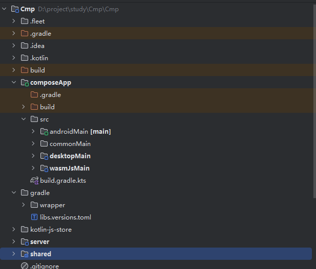

- composeApp：主要是ui代码及原生实现（不需要改）
- server：服务端代码，使用ktor实现
- shared：主要是功能性代码

#### 如何启动

下载好的就是一个模板，不需要任何代码就可以启动。默认是使用gradle作为构建工具的，点击gradle打开构建工具：

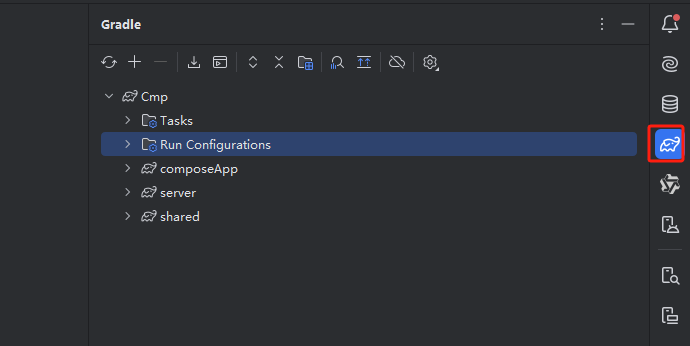

##### 跑安卓：

点击如图的installDebug即可：

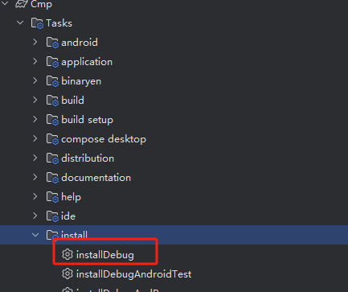

这时候你会发现，确实安装了安装包，但是需要手动点击才能运行，这也太蠢了。

我们添加一个task来自动安装：

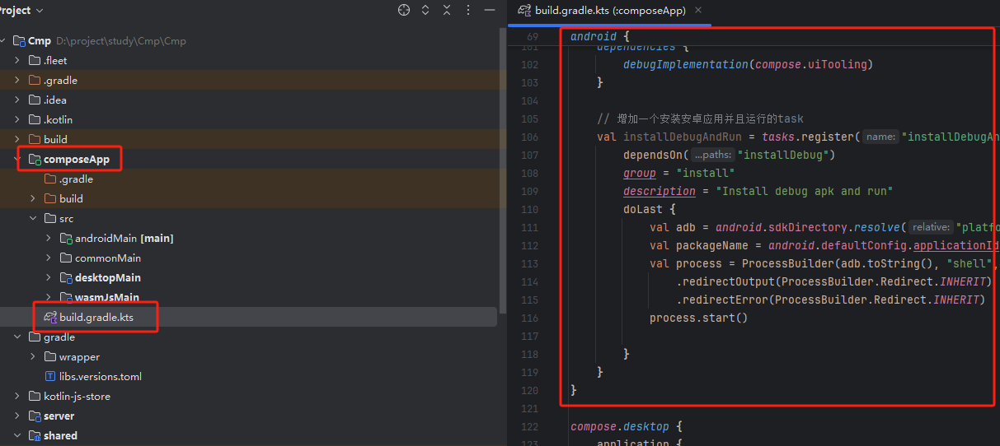

在composeApp模块下的build.gradle.kts的android闭包中加入如下代码：

```
// 增加一个安装安卓应用并且运行的task
    val installDebugAndRun = tasks.register("installDebugAndRun") {
        dependsOn("installDebug")
        group = "install"
        description = "Install debug apk and run"
        doLast {
            val adb = android.sdkDirectory.resolve("platform-tools").resolve("adb")
            val packageName = android.defaultConfig.applicationId
            val process = ProcessBuilder(adb.toString(), "shell", "am", "start", "-n", "$packageName/.MainActivity")
                .redirectOutput(ProcessBuilder.Redirect.INHERIT)
                .redirectError(ProcessBuilder.Redirect.INHERIT)
            process.start()

        }
    }
```

之后点击右上角的gradle中的同步按钮：

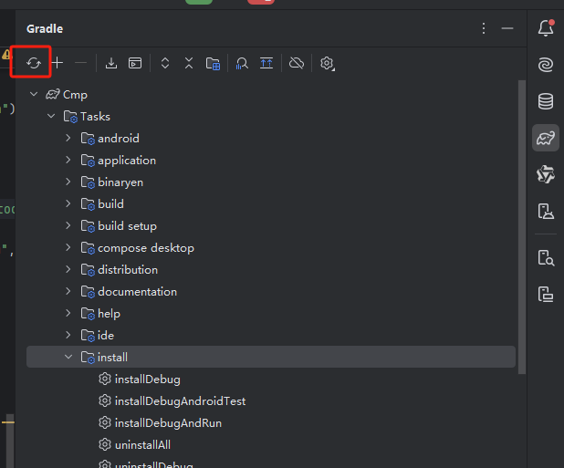

等待同步完成后，你的install中就多了一个task：

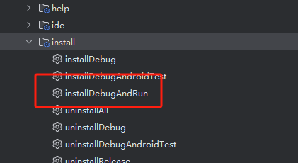

点击即可运行你的安卓应用啦。

你也可以像我一样，给每个任务取个名字：

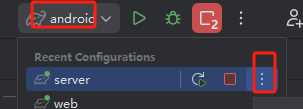

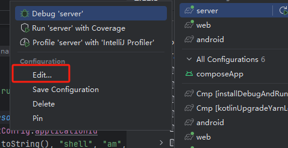

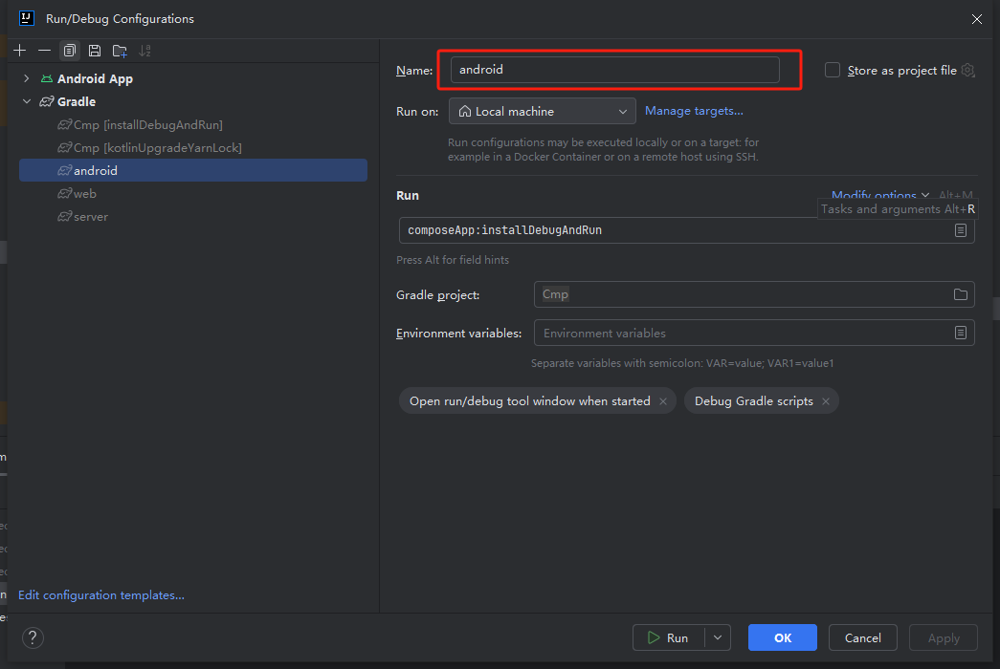

在上面输入你想要的名字，点击apply就行了。后面别的模块也是一样的，就不再赘述了。

补一个安卓运行的图，我这里是一个横向的安卓平板真机：

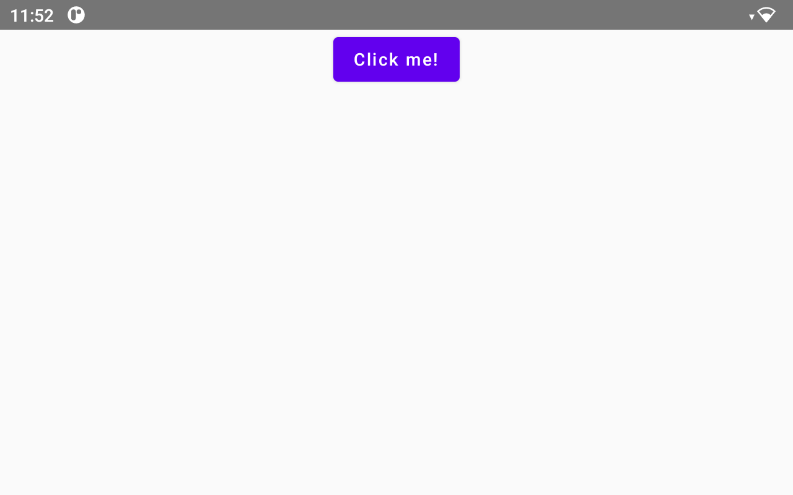

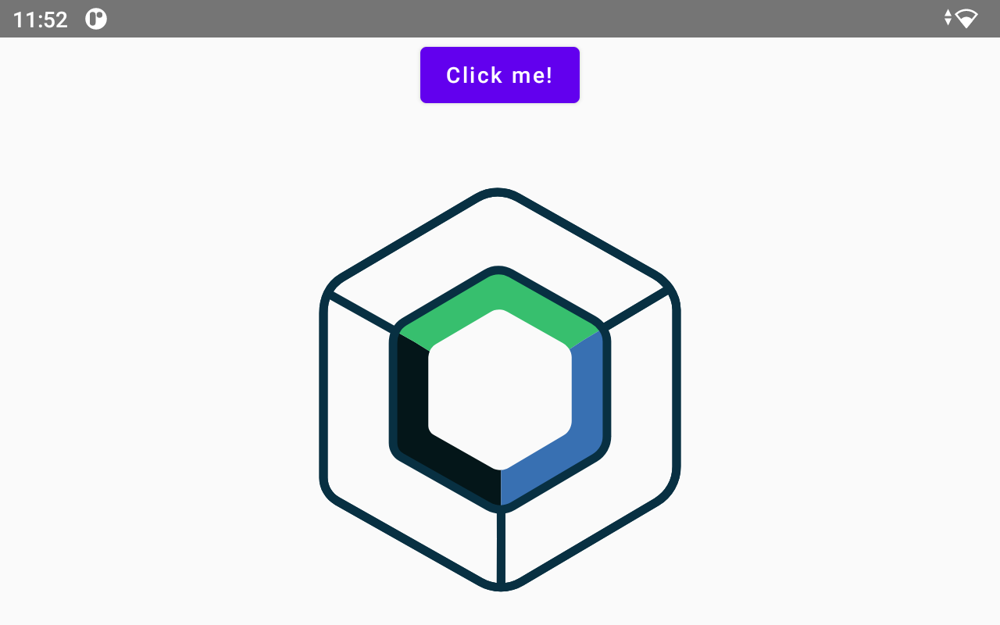

点击会显示一个图，再次点击会回到初始状态；这里下面其实还有个文字，我这里由于屏幕比例原因没显示出来。

##### 桌面端运行

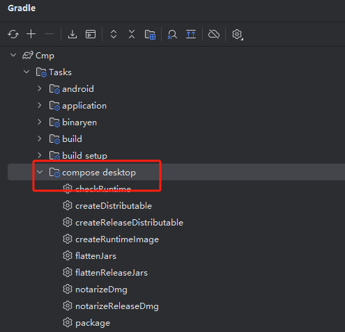

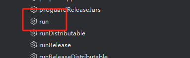

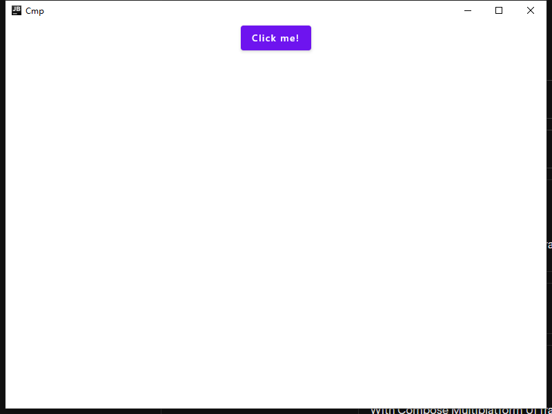

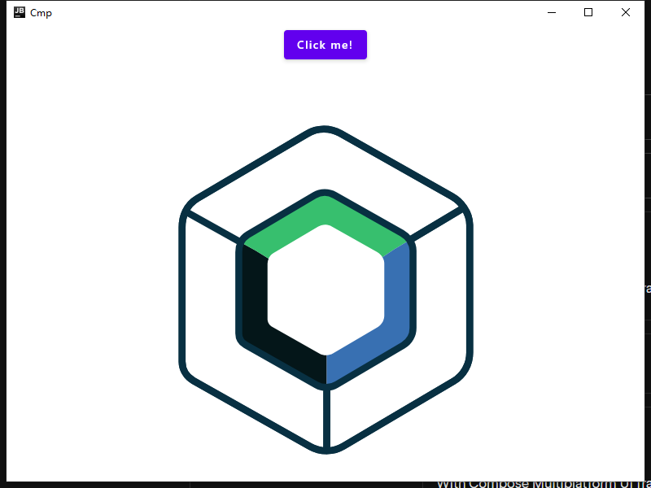

##### web网页运行

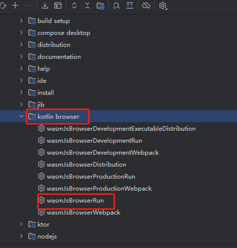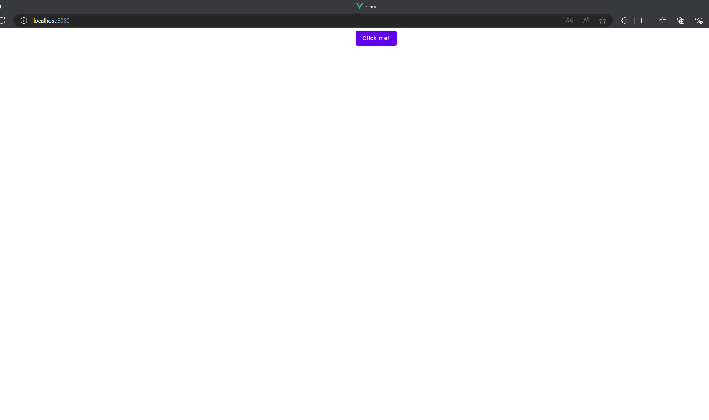

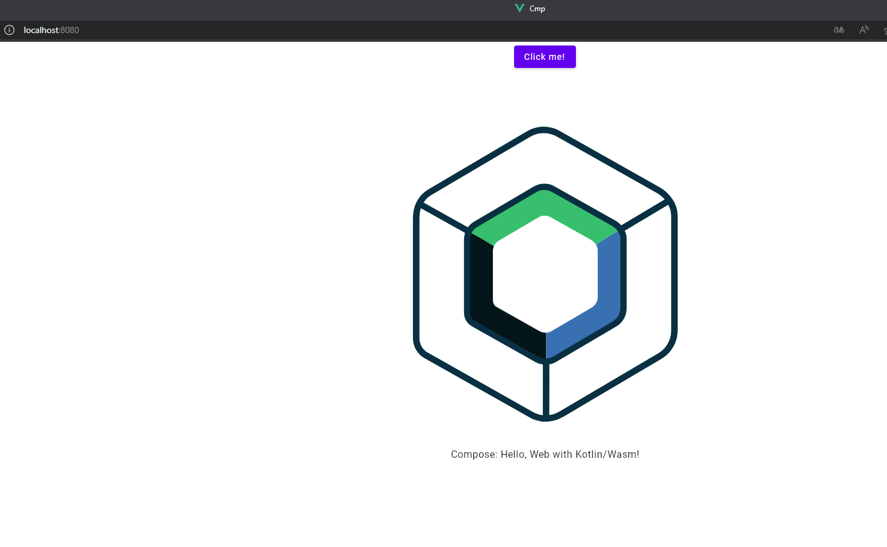

##### 服务器运行

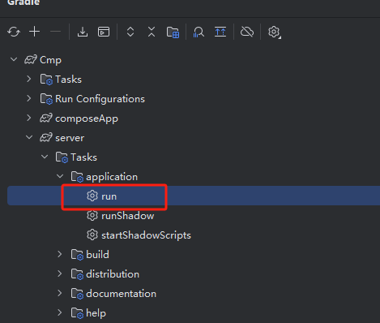

运行后控制台会有以下内容，说明你运行成功了：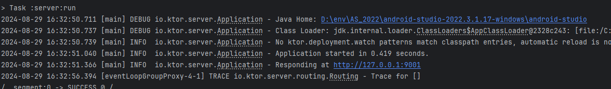

访问该地址，浏览器会显示get的相应信息，例如我应该在浏览器访问：

```
http://127.0.0.1:9001
```

ps：我这里是改了端口号，我发现默认用的8080和web的端口号重复了；修改位置在shared/src/commonMain/kotlin/com/mio/Constants中的SERVER_PORT